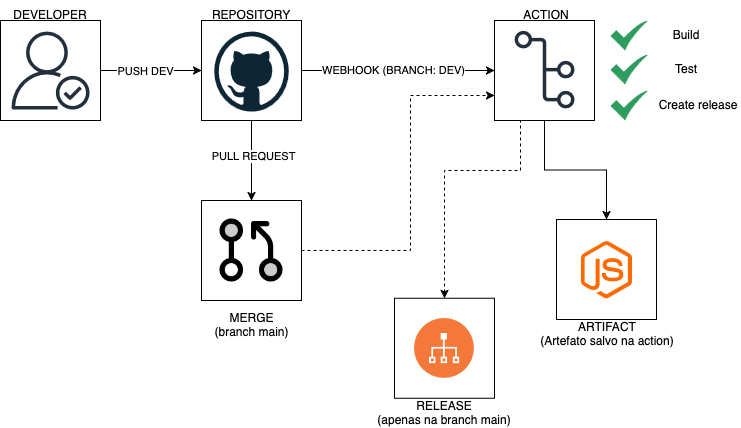

## 🚀 CI/CD Pipeline Act Digital

Este repositório contém um pipeline de CI/CD altamente eficiente e modular para projetos desenvolvidos pela Act Digital. Com foco na metodologia Don't Repeat Yourself (DRY), ele utiliza GitHub Actions em um modelo composite para assegurar reusabilidade, organização e simplicidade de manutenção.

### 📋 Visão Geral

O pipeline é acionado automaticamente em diferentes eventos:

    Push para a branch dev.

    Pull Requests direcionados para a branch main.

    Execução Manual via Workflow Dispatch.

Este pipeline integra etapas essenciais como clone do repositório, build, testes, armazenamento de artefatos e criação de releases, proporcionando automação completa do fluxo de integração e entrega contínua.
📦 Estrutura do Pipeline
Configuração de disparo:

```yaml
on:
  push:
    branches: [dev]
  pull_request:
    branches: [main]
  workflow_dispatch:
```
### Permissões:

As permissões do workflow garantem acesso de escrita aos conteúdos do repositório:

```yaml

permissions:
  contents: write
```

## Jobs:

O pipeline é composto pelo job actDigital_CI, que inclui as seguintes etapas:

####    SCM Clone

        Descrição: Clona o código do repositório Git para o ambiente de execução.

        Ação: actions/checkout@v4.

####    Build NPM

        Descrição: Realiza o processo de build da aplicação utilizando ferramentas do npm.

        Ação: ./.github/actions/build_app.

####    Test NPM

        Descrição: Executa testes unitários para assegurar a qualidade do código.

        Ação: ./.github/actions/test_app.

####    Upload Artifact

        Descrição: Armazena os artefatos gerados (build) para uso posterior no pipeline.

        Ação: ./.github/actions/upload_artifact.

####    Create Release

        Descrição: Cria uma release no GitHub com base nos artefatos do projeto.

        Ação: ./.github/actions/create_release.

        Input necessário: token (exemplo: ${{ secrets.GITHUB_TOKEN }}).

### 🛠️ Actions Composite
Por que Composite Actions?

As etapas do pipeline foram implementadas como Composite Actions para adotar a metodologia Don't Repeat Yourself (DRY):

    Reusabilidade: Cada ação individual pode ser reutilizada em outros workflows.

    Manutenção Simplificada: Alterações e melhorias podem ser realizadas centralmente, afetando todos os workflows que utilizam a ação.

### 🔑 Configuração de Segurança

    Token de Autenticação:

        O token GITHUB_TOKEN é usado para autenticação em etapas como upload de artefatos e criação de releases.

    Segredos do Repositório:

        Certifique-se de que variáveis sensíveis estão configuradas no Settings > Secrets do repositório.

### ✨ Benefícios

    Automação eficiente do ciclo de vida de desenvolvimento.

    Modificação simples com o uso de composite actions.

    Flexível para diversas aplicações baseadas em Node.js.

---
### 📊 DIAGRAMA
